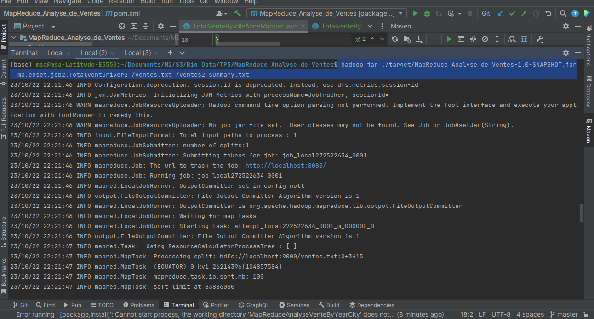

# Jobs Map Reduce

1. Job Map Reduce pour le calcul des ventes totales par ville
2. Job Map Reduce pour le calcul des ventes totales par ville et Année
3. Job Map Reduce pour le calcul des le nombre total de
   requêtes et le nombre de requêtes réussies par addresIp

## Project Overview

1. On souhaite développer un Job Map Reduce permettant, à partir d’un
   fichier texte (ventes.txt) en entré, contenant les ventes d’une entreprise dans
   les différentes villes, de déterminer le total des ventes par ville. La structure
   du fichier ventes.txt est de la forme suivante :
   date ville produit prix
   Vous testez votre code en local avant de lancer un job sur le cluster Hadoop.

2. Vous créez un deuxième job permettant de calculer le prix total des ventes
   des produits par ville pour une année donnée.

## Screenshots

### 1ère Partie

### 2ème Partie

### 3ème Partie

